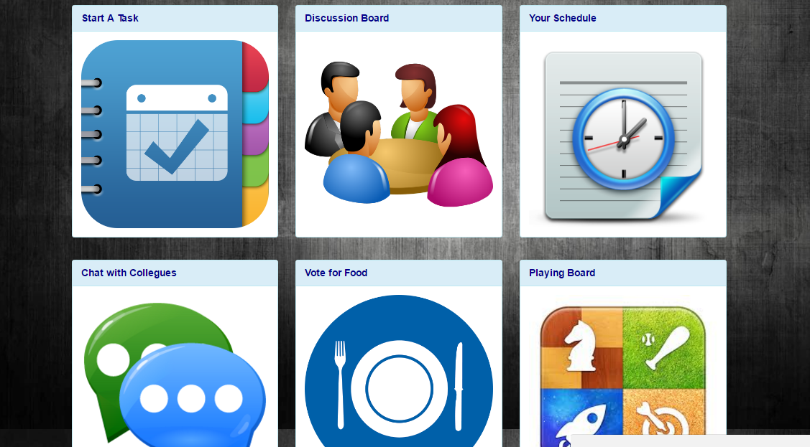
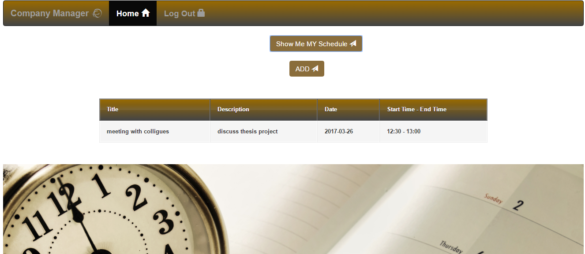
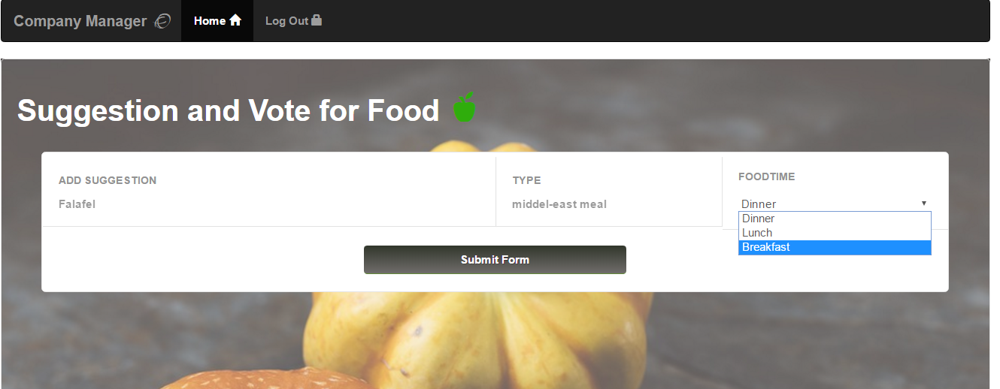
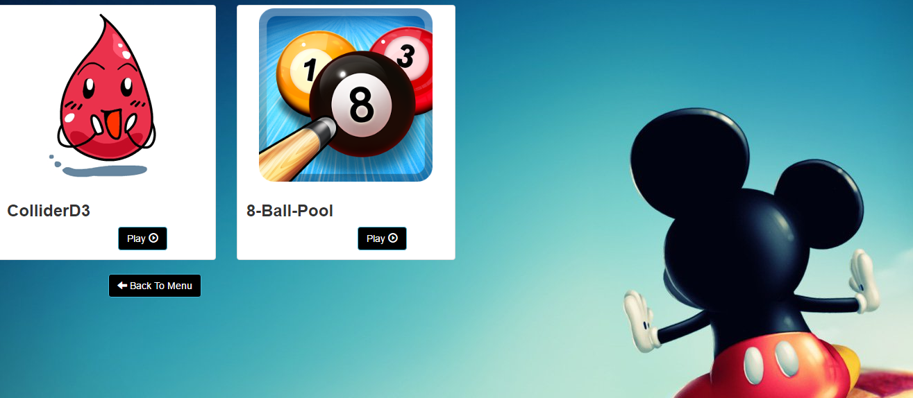

#  Company Manager ~~ Thesis Project

> Our website saves time and effort for companies, it helps company members to interact effectively with each other.
With our website, companies will be able to add schedule, set meetings, add tasks and many other helpers in our website will aid in companies functionality.

## Table of Contents

1. Team.
2. Installation.
3. Usage.

4.Dependencies.

## Team

- __Product Owner__: Maher Ghanom
- __Scrum Master__: Ahmad Almaradni
- __Development Team Members__: Zainab Hammami, Ayaa Hassan.

## Installation:  

1- First, Go to our organization "Om-Ta7seen" and fork the repo.

2- Now from your account, clone the repo into your local PC.

3-When ever you have made any modification, don't forget to:
-git add .
-git push origi
-git commit -m "" be well organized about commiting your code, and avoiding conflicts by assigning tasks between group members.

4-You have to be well organized about commiting your code, and avoiding conflicts by assigning tasks between group members.

## Usage:

-When you visit the website you should be able to see something like this:
  

	
	  

	-You will notice the 'About Us' icon, it take to the page where it will show a small introduction about us 'as developers'.
	  
	

		
		  

		-If you want to make account in the website, you should specify if you were the admin who will create the company or if you just an employee, and it is highly secured beacuse we are sending code to the manger who will create the company and the manager will send it back to his employees, so only who has the code will be added to the same company.
		  
		

			
			  

			-Now you have the account, you should be able to see your company main page and start interact with collegues.
			  
			

				
				  

				-Let's start with some features. First, we have creating tasks feature.
				  
				

					
					  

					-Second, you will see the schedule icon and start setting meetings, so it should drives you to this:
					  
					

						
						  

						-Also, you can suggest your favorite dish.
						  
						

							
							  

							and vote for it:
							  
							

								
								  

								-You can also chat with other collegues.
								  
								

									
									  

									-Finally, you can have some fun with games, and waste some of your free time here:
									  
									

										
										  

										## Dependencies:
										1. Node.Js and express for the back-end
										2. MongoDB for data-base.
										3. Angular2, Bootstrap for front-end.